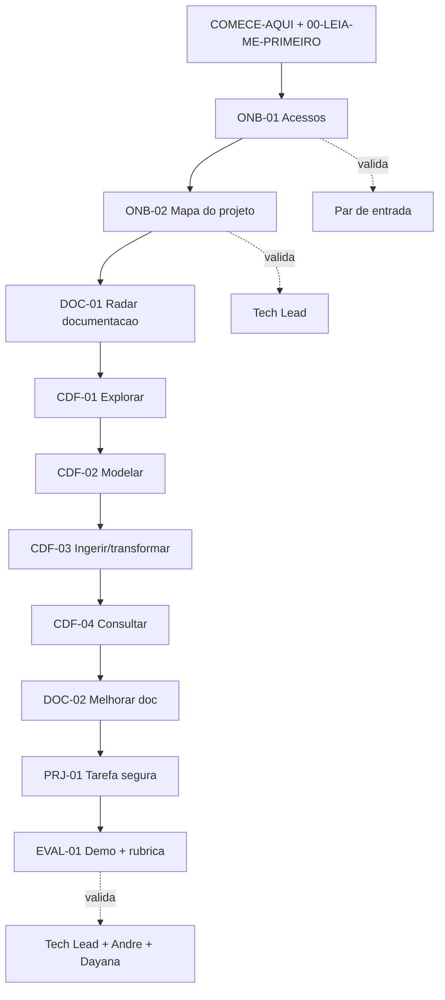
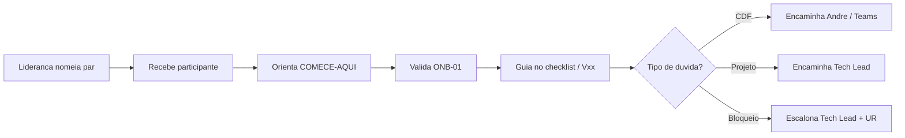
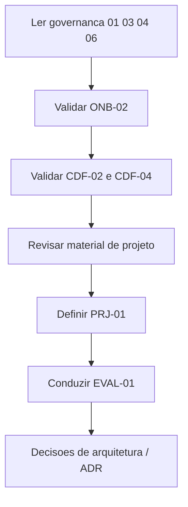
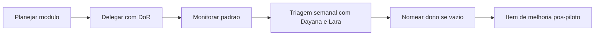
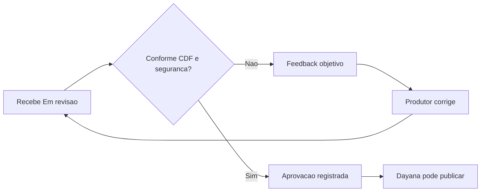
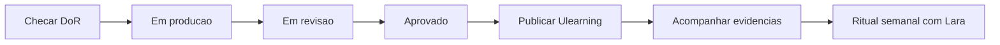
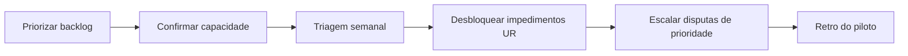
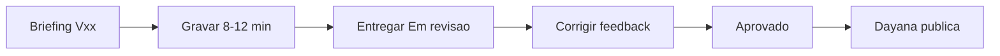

Referência operacional: **o que cada persona faz, em que ordem**. Cada passo termina em **evidência** registrada (ver `checklists/CHECKLIST-MESTRE.md`). Apresentação unificada: `pitch/Pitch-Operacao-do-Modelo.pptx` (implantação + fluxos por persona + storytelling).

## Participante em onboarding

| Passo | Entrega | Validador | Apoio |
|-------|---------|-----------|-------|
| ONB-01 | Checklist de acesso | Par de entrada | V02 |
| ONB-02 | Canvas do projeto | Tech Lead | V13, V14 |
| DOC-01 | Radar de fontes | Dono do conteúdo | — |
| CDF-01..04 | Evidências técnicas | Especialista / Tech Lead | V03–V12 |
| DOC-02 | PR ou proposta de doc | Dono do conteúdo | V16 |
| PRJ-01 | Pequena entrega aceita | Tech Lead | V13 |
| EVAL-01 | Demo 10 min | Tech Lead + André + Dayana | Rubrica 06 |

## Par de entrada

**Não faz:** aprovar arquitetura, publicar conteúdo, decidir escopo de módulo.

## Tech Lead

| Momento | Ação |
|---------|------|
| Início | Alinhar canvas e ritos com o participante |
| Durante trilha | Validar práticas no contexto do projeto |
| Revisão | Aprovar ou devolver material específico de projeto |
| Fechamento | Rubrica de prontidão e handoff para demanda produtiva |

## Gilson — estruturação

## André — aprovação técnica CDF

## Dayana — operação UR

## Lara — responsável UR

## Produtor de vídeo

**Regra:** dado sintético ou sanitizado apenas; mudança de escopo volta ao backlog antes de gravar.

## Liderança — kickoff do piloto

1. Assistir `pitch/Pitch-Trilha-Onboarding-CDF.pptx`
2. Aprovar grupo piloto, datas e par de entrada por pessoa
3. Garantir acessos antes de ONB-01
4. Acompanhar tempo até primeira entrega segura
5. Patrocinar retrospectiva e decisão de expansão

## Escalonamento rápido

| Situação | Acionar |
|----------|---------|
| Conceito CDF | André Alves |
| Arquitetura do projeto | Tech Lead |
| Acesso / ONB-01 | Par de entrada |
| Publicação / progresso | Dayana Viana |
| Prioridade / capacidade UR | Lara Menezes |
| Estrutura / padrão do pacote | Gilson Cesar da Costa |
| Bloqueio persistente | Par de entrada + Tech Lead + UR |
