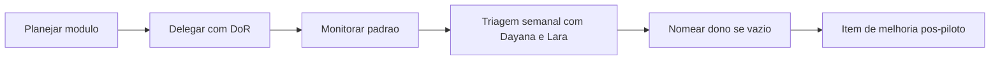

# Guia da Liderança

Este é o **único documento** para quem patrocina o piloto de onboarding e para Gilson Cesar da Costa na estruturação do pacote.

## Kickoff do piloto (liderança)

1. Assistir `pitch/Pitch-Trilha-Onboarding-CDF.pptx` ou `pitch/Pitch-Operacao-do-Modelo.pptx`.
2. Aprovar grupo piloto, datas e **par de entrada** por participante.
3. Garantir acessos antes de [ONB-01](../governanca/04-BACKLOG-DE-ONBOARDING.md#onb-01).
4. Acompanhar tempo até primeira entrega segura ([PRJ-01](../governanca/04-BACKLOG-DE-ONBOARDING.md#prj-01)).
5. Patrocinar retrospectiva e decisão de expansão.

## O que a liderança não precisa fazer

- Validar entregas técnicas (Tech Lead e André).
- Publicar na Ulearning (Dayana).
- Gravar vídeos (produtor designado).

## Estruturação do pacote (Gilson)

| Responsabilidade | Entrega |
|---|---|
| Arquitetura da trilha | Pacote v1.2 consolidado |
| Backlog padrão | `docs/governanca/04-BACKLOG-DE-ONBOARDING.md` |
| Roteiros-base | `docs/treinamento/Vxx/` |
| Padrões de documentação | `docs/entrada/`, `docs/perfis/` |

## As 3 camadas do pacote

1. **Pitch** — explicar em minutos (`pitch/`).
2. **Checklist** — o que fazer (`checklists/`, `docs/treinamento/Vxx/CHECKLIST.md`).
3. **Documentação** — aprofundar (`docs/`).

## Métricas de sucesso do piloto

- Participantes concluem ONB-01 em até 1 semana.
- Evidências registradas em 100% dos itens fechados.
- Tempo até PRJ-01 dentro do combinado com Tech Lead.
- Retrospectiva gera itens de melhoria no backlog.

## Escalonamento

| Situação | Contato |
|---|---|
| Prioridade / capacidade UR | Lara Menezes |
| Aprovação técnica CDF | André Alves |
| Operação e publicação | Dayana Viana |
| Arquitetura do projeto | Tech Lead |

## Referências

- Framework: `docs/entrada/FRAMEWORK-DE-ONBOARDING.md`
- Governança: `docs/governanca/01-GOVERNANCA-E-RESPONSAVEIS.md`
- Fluxo por persona: `docs/entrada/FLUXO-POR-PERSONA.md`
