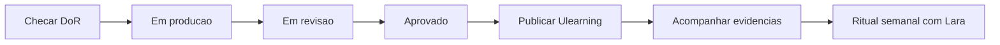
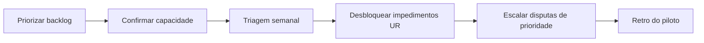

# Guia da Operação UR

Este é o **único documento** para Dayana Viana (execução e publicação) e Lara Menezes (prioridade e capacidade). Cobre o ciclo operacional da trilha na UR.

## Papéis

| Pessoa | Responsabilidade |
|---|---|
| Dayana Viana | Publicação Ulearning, progresso, evidências, operação cotidiana |
| Lara Menezes | Prioridade, capacidade, impedimentos, escalonamento |

## Fluxo Dayana — publicação

## Fluxo Lara — prioridade

## Definition of Ready (antes de "Em produção")

- [ ] Roteiro e escopo definidos no backlog.
- [ ] Dono de gravação e aprovador técnico nomeados.
- [ ] Ambiente de demonstração disponível.
- [ ] Critério de aceite do vídeo claro.

## Definition of Done (antes de "Publicado")

- [ ] Aprovação técnica registrada (André para CDF).
- [ ] Vídeo 8–12 min, 1080p, credenciais mascaradas.
- [ ] Legenda e miniatura entregues.
- [ ] Link registrado no backlog/Ulearning com versão e data.

## Entregas que você acompanha

| ID | Papel UR | Definição |
|---|---|---|
| EVAL-01 | Dayana participa da avaliação e registra resultado | [EVAL-01](../governanca/04-BACKLOG-DE-ONBOARDING.md#eval-01) |
| Vídeos V00–V16 | Dayana publica após aprovação; Lara prioriza produção | `docs/treinamento/Vxx/` |

## Publicação na Ulearning

Detalhes em `docs/governanca/07-PUBLICACAO-ULEARNING.md`:

1. Receber versão **Aprovada** (não publicar "Em revisão").
2. Registrar local, data, público e link.
3. Acompanhar se participantes registram evidências nos itens de backlog.

## Rituais

- **Semanal:** Dayana + Lara — progresso, bloqueios, capacidade de gravação.
- **Triagem:** itens sem dono voltam a Gilson + Lara para nomeação.

## Escalonamento

| Situação | Ação |
|---|---|
| Disputa de prioridade | Lara decide |
| Falta de aprovador técnico | Bloquear publicação; acionar André ou Tech Lead |
| Trilha sem evidência | Reabrir item; Dayana corrige operacionalmente |
| Padrão do pacote | Gilson Cesar da Costa |

## Referências

- Fluxo operacional: `docs/governanca/02-FLUXO-OPERACIONAL-DA-TRILHA.md`
- Governança: `docs/governanca/01-GOVERNANCA-E-RESPONSAVEIS.md`
- Briefing de vídeo: `docs/governanca/09-TEMPLATES/01-BRIEFING-DE-VIDEO.md`
