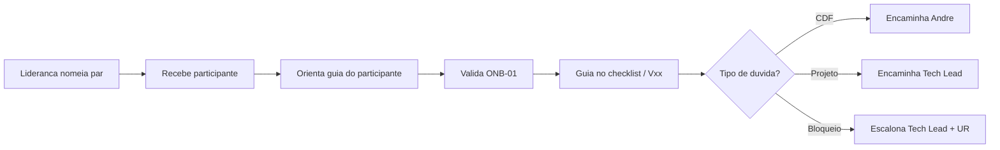

# Guia do Par de Entrada

Este é o **único documento** para quem acompanha um participante no onboarding. Você orienta, valida ONB-01 e encaminha dúvidas — não aprova arquitetura nem publica conteúdo.

## Seu papel

## O que você faz (e o que não faz)

| Faz | Não faz |
|---|---|
| Orienta o participante no pacote | Aprovar arquitetura ou modelagem |
| Valida ONB-01 (acessos) | Publicar conteúdo na Ulearning |
| Acompanha progresso no checklist | Decidir escopo de módulo ou vídeo |
| Encaminha dúvidas ao responsável | Autoaprovar entregas técnicas |

## Entregas que você valida

| ID | O que validar | Definição |
|---|---|---|
| ONB-01 | Checklist de acesso preenchido; acessos mínimos ativos ou plano para pendências | [ONB-01](../governanca/04-BACKLOG-DE-ONBOARDING.md#onb-01) |

## Passo a passo na primeira semana

1. Receba o participante e confirme que a liderança nomeou você como par.
2. Indique o guia: `docs/perfis/GUIA-PARTICIPANTE.md`.
3. Liste acessos obrigatórios (conta, tenant sandbox, repositório, canal).
4. Acompanhe instalação de `docs/requirements.txt` e configuração de `.env`.
5. Valide ONB-01 quando o checklist estiver completo.
6. A partir daí, o Tech Lead assume validações técnicas; você permanece como ponto de apoio operacional.

## Critério de aceite para ONB-01

- Participante autentica no CDF (sandbox) sem expor segredos.
- Repositório e canal de comunicação acessíveis.
- Pendências documentadas com responsável e prazo.

## Escalonamento

| Situação | Acionar |
|---|---|
| Dúvida de conceito CDF | André Alves |
| Arquitetura / escopo do projeto | Tech Lead |
| Acesso bloqueado sem previsão | Tech Lead + Lara Menezes |
| Publicação ou evidência | Dayana Viana |
| Padrão do pacote | Gilson Cesar da Costa |

## Referências

- Checklist mestre: `checklists/CHECKLIST-MESTRE.md`
- Backlog: `docs/governanca/04-BACKLOG-DE-ONBOARDING.md`
- Vídeo de apoio ONB-01: `docs/treinamento/V02-IAM-E-ACESSO-SEGURO/`
