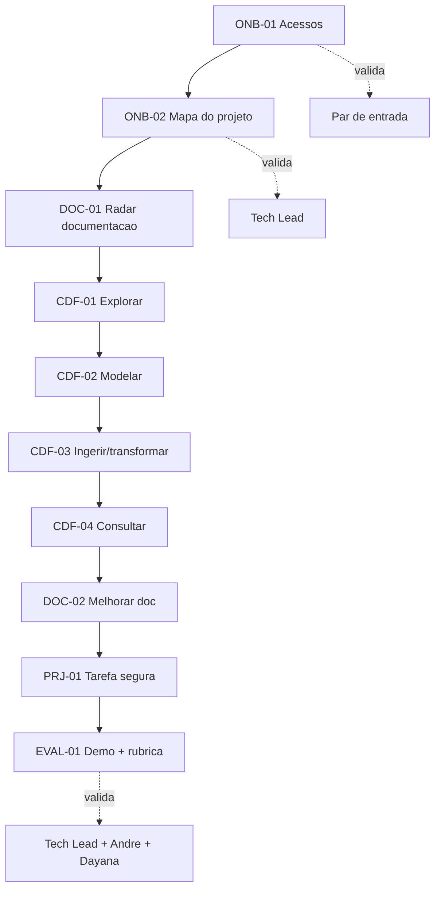

# Guia do Participante

Este é o **único documento** que você precisa abrir para entender toda a sua jornada de onboarding. Cada passo termina em **evidência** registrada no backlog.

## O que você vai fazer

Completar 10 entregas na ordem abaixo, usando vídeos e notebooks como apoio. Nenhuma atividade termina com "feito" sem evidência.

## Suas entregas (com definição completa)

| Ordem | ID | O que entregar | Validador | Definição |
|---:|---|---|---|---|
| 1 | ONB-01 | Checklist de acesso | Par de entrada | [ONB-01](../governanca/04-BACKLOG-DE-ONBOARDING.md#onb-01) |
| 2 | ONB-02 | Canvas do projeto | Tech Lead | [ONB-02](../governanca/04-BACKLOG-DE-ONBOARDING.md#onb-02) |
| 3 | DOC-01 | Radar de documentação | Dono do conteúdo | [DOC-01](../governanca/04-BACKLOG-DE-ONBOARDING.md#doc-01) |
| 4 | CDF-01 | Mapa asset-centric | Especialista CDF | [CDF-01](../governanca/04-BACKLOG-DE-ONBOARDING.md#cdf-01) |
| 5 | CDF-02 | DMS + justificativa | Tech Lead | [CDF-02](../governanca/04-BACKLOG-DE-ONBOARDING.md#cdf-02) |
| 6 | CDF-03 | Notebook/SQL reproduzível | Data Eng / Tech Lead | [CDF-03](../governanca/04-BACKLOG-DE-ONBOARDING.md#cdf-03) |
| 7 | CDF-04 | Query + interpretação | Tech Lead | [CDF-04](../governanca/04-BACKLOG-DE-ONBOARDING.md#cdf-04) |
| 8 | DOC-02 | PR ou proposta de doc | Dono do conteúdo | [DOC-02](../governanca/04-BACKLOG-DE-ONBOARDING.md#doc-02) |
| 9 | PRJ-01 | Pequena entrega aceita | Tech Lead | [PRJ-01](../governanca/04-BACKLOG-DE-ONBOARDING.md#prj-01) |
| 10 | EVAL-01 | Demo 10 min + rubrica | Tech Lead + André + Dayana | [EVAL-01](../governanca/04-BACKLOG-DE-ONBOARDING.md#eval-01) |

## Como executar cada fase

### Preparação (ONB-01, ONB-02)

1. Peça ao par de entrada a lista de acessos obrigatórios.
2. Instale dependências: `pip install -r docs/requirements.txt`.
3. Assista V02 e preencha o checklist de acesso.
4. Leia material de projeto indicado pelo Tech Lead; preencha o canvas (apoio: V13, V14).
5. Use `pitch/TEMPLATE-Pitch-do-Projeto.pptx` como modelo de síntese.

### Documentação (DOC-01, DOC-02)

1. Mapeie fontes do projeto e classifique (atual / desatualizada / ausente).
2. Escolha uma lacuna pequena e proponha correção via PR (apoio: V16).

### Práticas CDF (CDF-01 a CDF-04)

1. Leia `docs/entrada/GUIA-DE-EXECUCAO.md` antes de abrir qualquer notebook.
2. Execute notebooks na pasta `docs/treinamento/Vxx/` na ordem do guia.
3. Use apenas sandbox; prefixo obrigatório: `sp_ur_training_vNN_<run>`.
4. Registre evidência e link no item do backlog.

| Entrega | Vídeos de apoio | Pasta |
|---|---|---|
| CDF-01 | V03–V06 | `docs/treinamento/V03-...` a `V06-...` |
| CDF-02 | V04, V05 | `docs/treinamento/V04-...`, `V05-...` |
| CDF-03 | V07–V09 | `docs/treinamento/V07-...` a `V09-...` |
| CDF-04 | V10–V12 | `docs/treinamento/V10-...` a `V12-...` |

### Projeto e avaliação (PRJ-01, EVAL-01)

1. Alinhe tarefa segura com o Tech Lead (apoio: V13).
2. Prepare demo de até 10 min com modelo, pipeline, consulta e limites.
3. Rubrica em `docs/governanca/06-AVALIACAO-E-PRONTIDAO.md`.

## Regras de segurança

- Nunca versionar token, senha ou dado pessoal.
- Escrever apenas em sandbox, salvo autorização explícita.
- Limpar recursos temporários ao final de cada notebook.
- Máximo de dois itens ativos no backlog por vez.

## Checklist rápido

Use `checklists/CHECKLIST-MESTRE.md` para marcar progresso. Cada item só fecha com evidência registrada.

## Quem acionar

| Situação | Contato |
|---|---|
| Acesso / ONB-01 | Par de entrada |
| Arquitetura do projeto | Tech Lead |
| Conceito CDF | André Alves |
| Publicação / progresso | Dayana Viana |
| Prioridade / capacidade | Lara Menezes |
| Estrutura do pacote | Gilson Cesar da Costa |

## Referências complementares

- Backlog completo: `docs/governanca/04-BACKLOG-DE-ONBOARDING.md`
- Especificação técnica CDF: `docs/governanca/03-ESPECIFICACAO-TECNICA-CDF.md`
- Mapa de vídeos: `docs/entrada/INDICE.md`
