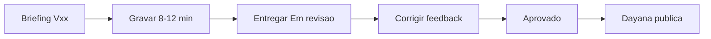

# Guia do Produtor de Vídeo

Este é o **único documento** para quem grava vídeos da trilha. Você não precisa conhecer a trilha inteira — apenas o roteiro do seu `Vxx`.

## Seu fluxo

## Antes de gravar

1. Abra a pasta do seu vídeo: `docs/treinamento/Vxx-<NOME>/`.
2. Leia o roteiro (`Vxx-*.md`), o `CHECKLIST.md` e o guia/notebook se houver.
3. Confirme **Definition of Ready** com Dayana (escopo, aprovador, ambiente).
4. Use `docs/governanca/09-TEMPLATES/01-BRIEFING-DE-VIDEO.md` se necessário.

## Padrão de gravação

| Regra | Detalhe |
|---|---|
| Duração | 8–12 minutos (tolerância 15); se não couber, abrir `Vxx.1` |
| Ambiente | Demonstração ou dados sintéticos apenas |
| Segurança | Mascarar credenciais, URLs privadas, dados pessoais |
| Resolução | 1080p; comandos e código pausáveis |
| Entrega | Arquivo-fonte, vídeo final, legenda, miniatura |

## Estrutura do roteiro

Cada pasta `docs/treinamento/Vxx/` contém:

- Roteiro cronometrado (`Vxx-*.md`)
- `CHECKLIST.md` de gravação
- Guia de execução e/ou notebook (quando aplicável)

Mapa completo: `docs/entrada/INDICE.md`.

## Entrega vinculada ao backlog

Cada vídeo apoia uma ou mais entregas do participante. No roteiro, a seção **Entrega vinculada** indica o link (ex.: V04 → CDF-02). Consulte `docs/governanca/04-BACKLOG-DE-ONBOARDING.md` para o critério de aceite da entrega.

## Aprovação

1. Envie no estado **Em revisão** com fontes e evidência de ambiente sanitizado.
2. André Alves valida conteúdo técnico CDF.
3. Corrija feedback objetivo (arquivo, trecho, ação).
4. Dayana publica somente versão **Aprovada**.

## O que não fazer

- Gravar em tenant produtivo sem autorização.
- Alterar escopo sem registrar no backlog.
- Publicar ou marcar como aprovado sem revisor humano.

## Escalonamento

| Situação | Contato |
|---|---|
| Dúvida técnica CDF | André Alves |
| Escopo / prioridade | Lara Menezes |
| Publicação | Dayana Viana |
| Roteiro-base / padrão | Gilson Cesar da Costa |

## Referências

- README da trilha: `docs/treinamento/README.md`
- Validação de vídeo: `docs/governanca/09-TEMPLATES/03-VALIDACAO-DE-VIDEO.md`
- Publicação: `docs/governanca/07-PUBLICACAO-ULEARNING.md`
