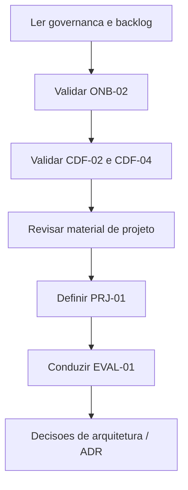
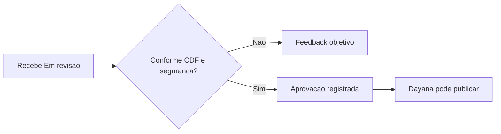

# Guia do Tech Lead

Este é o **único documento** para quem valida práticas técnicas e conduz a prontidão do participante no projeto. Inclui o papel de aprovação técnica CDF (André Alves) quando aplicável a conteúdo da trilha.

## Seu papel

## Entregas que você valida

| ID | O que validar | Definição |
|---|---|---|
| ONB-02 | Canvas do projeto: escopo, ritos, fontes | [ONB-02](../governanca/04-BACKLOG-DE-ONBOARDING.md#onb-02) |
| CDF-02 | Recorte DMS: space, container, view, relações | [CDF-02](../governanca/04-BACKLOG-DE-ONBOARDING.md#cdf-02) |
| CDF-03 | Pipeline idempotente + limpeza (com Data Eng se necessário) | [CDF-03](../governanca/04-BACKLOG-DE-ONBOARDING.md#cdf-03) |
| CDF-04 | Query e interpretação corretas | [CDF-04](../governanca/04-BACKLOG-DE-ONBOARDING.md#cdf-04) |
| PRJ-01 | Tarefa segura aceita no projeto | [PRJ-01](../governanca/04-BACKLOG-DE-ONBOARDING.md#prj-01) |
| EVAL-01 | Demo + rubrica (com André e Dayana) | [EVAL-01](../governanca/04-BACKLOG-DE-ONBOARDING.md#eval-01) |

## Momento de atuação

| Momento | Ação |
|---|---|
| Início | Indicar material de contexto; alinhar canvas (ONB-02) |
| Durante trilha | Validar CDF-02, CDF-03, CDF-04 no contexto do projeto |
| Documentação | Validar ou indicar dono para DOC-01/DOC-02 |
| Fechamento | Conduzir EVAL-01; registrar decisão de prontidão |

## Como dar feedback

- Aponte arquivo, trecho, ação solicitada e critério técnico.
- Devolva com objetividade; não autoaprove se você é o validador.
- Mudança de escopo de prática ou vídeo: registrar no backlog antes de produzir.

## Rubrica de avaliação (EVAL-01)

Consulte `docs/governanca/06-AVALIACAO-E-PRONTIDAO.md`:

- **Aprovado:** ≥ 70 pontos, sem bloqueio crítico.
- **Aprovado com plano:** 60–69, lacunas com prazo.
- **Reexecutar:** < 60 ou evidência insuficiente.
- **Bloqueio crítico:** segredo exposto, escrita em produção, sem rastreabilidade, arquitetura sem validação.

## Aprovação técnica CDF (André Alves)

Para materiais da trilha (roteiros, notebooks, conteúdo CDF genérico):

## Escalonamento

| Situação | Contato |
|---|---|
| Prioridade / capacidade UR | Lara Menezes |
| Publicação Ulearning | Dayana Viana |
| Padrão do pacote / trilha | Gilson Cesar da Costa |
| Bloqueio persistente | Par de entrada + UR |

## Referências

- Especificação técnica: `docs/governanca/03-ESPECIFICACAO-TECNICA-CDF.md`
- Governança: `docs/governanca/01-GOVERNANCA-E-RESPONSAVEIS.md`
- Backlog: `docs/governanca/04-BACKLOG-DE-ONBOARDING.md`
